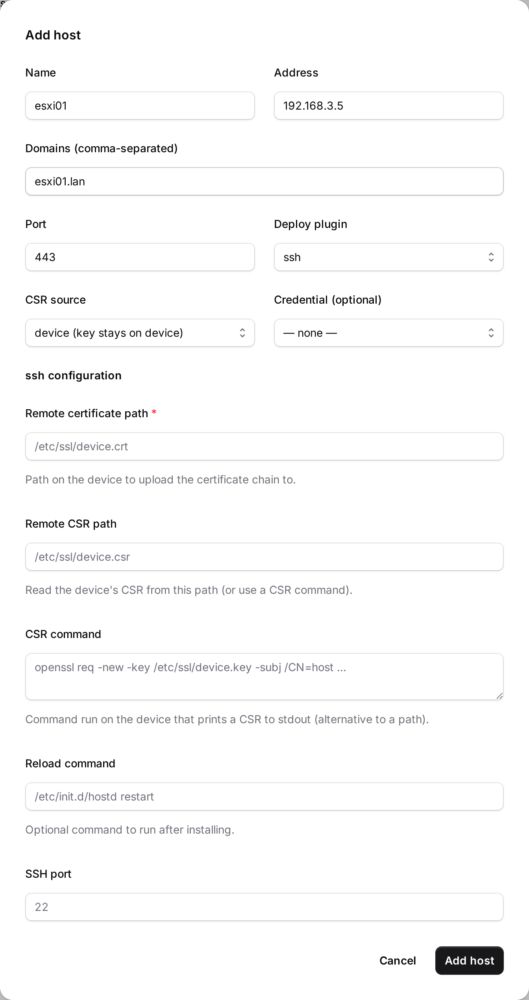

# acme-lan

> [!WARNING]
> **Personal project — not production-ready.** I run this on my own LAN and it works for
> me, but it is not hardened, audited, or supported, and it almost certainly still has
> serious security bugs. It is squarely in the blast radius if it does: it issues real
> publicly-trusted certificates, holds your DNS provider credentials, and stores logins
> for the devices it deploys to.
>
> Treat that as a concrete warning rather than boilerplate. A review before this repo was
> made public found two authorization flaws in the ACME endpoints — any client could
> modify or deactivate another account, and revoke certificates it did not own. Both are
> fixed, but they sat there unnoticed, so assume others remain.
>
> If you run it anyway: keep it on a trusted network, set `ACME_LAN_ADMIN_TOKEN` (the
> management API is open by default and can export private keys), and read
> [docs/SECURITY.md](docs/SECURITY.md) first. Issues and fixes are welcome.

An **internal ACME server** for split-horizon LANs. Point standard ACME clients
(`certbot`, `acme.sh`) at it and they receive **real, publicly-trusted certificates** — even
for hosts that only exist on your LAN and are never exposed to the internet. For devices that
can't run ACME at all (ESXi, switches, printers…), acme-lan **issues and installs the cert
for them**.

acme-lan speaks RFC 8555 to your internal clients, then fulfils each request by acting as an
ACME *client* to a real public CA (Let's Encrypt / ZeroSSL), proving control with a
**DNS-01** challenge against your public zone. Only this one server holds the DNS
credentials.

```
 internal client            acme-lan (this server)              upstream CA (Let's Encrypt)
 certbot / acme.sh  ──ACME──▶  ACME server  ─────ACME client────▶  real issuance
                               │  proves LAN control (http-01 / tls-alpn-01)
                               └▶ publishes _acme-challenge TXT ──▶ upstream DNS-01 validates
```

## When would I use this?

- **Internal services on a public domain.** `db.example.net` resolves to `192.168.3.5` on
  the LAN (a real public zone in split-horizon DNS). You want a browser-trusted cert on it,
  but it isn't reachable from the internet and you don't want to put DNS-provider API tokens
  on every host. Run acme-lan once; point clients at it.
- **Appliances that can't run ACME.** ESXi/vCenter, iDRAC/iLO, switches, routers, printers,
  NAS, load balancers — acme-lan generates or signs their cert and pushes it over SSH (or a
  custom plugin), then renews it automatically. See [device push](#device-push) below.
- **Kill TLS warnings everywhere on the LAN**, including on acme-lan's own dashboard (it can
  [certify itself](docs/DEPLOYMENT.md#6-serving-acme-lan-over-trusted-https)).
- **Front a CA that isn't Let's Encrypt.** Proxy to an EAB-authenticated CA (e.g. DigiCert),
  or issue from a **private CA** for things like WiFi/EAP certificates — all through the same
  standard ACME interface. See [multiple listeners](docs/DEPLOYMENT.md#9-extra-acme-listeners-digicert--private-ca).

If your hosts *can* reach the internet and hold DNS credentials, you may not need acme-lan —
a normal ACME client with a DNS plugin is simpler. acme-lan earns its keep when the hosts are
isolated, can't run ACME, or you want one place to manage and monitor every LAN certificate.

## Dashboard

The built-in dashboard lists every issued certificate with a **realtime TLS health** badge
(a raw-TLS probe — works for LDAPS/SMTPS/etc., not just HTTPS), manages device-push hosts,
and can probe any `host:port` on demand. Certificate and host lists have search, sorting and
paging, and renewed-away certificates are folded out of the default view.

It is also where you configure the server: **every** setting is on the Settings screen and
saved to a YAML file, with options that come from an environment variable shown read-only
and labelled as enforced. Device credentials, the Key Vault / Vault storage backends, users
and single sign-on (local passwords or OIDC, with a guided Microsoft Entra ID flow) are all
managed there — see the [deployment guide](docs/DEPLOYMENT.md#4-configuration-reference).


## Device push

For hardware that can't run an ACME client, register it as a **managed host** and acme-lan
handles issuance + installation + renewal. Two modes:

- **`device` (preferred)** — acme-lan retrieves a CSR from the device, signs it, and pushes
  back only the certificate. **The private key never leaves the device.**
- **`local`** — acme-lan generates the key + CSR and pushes both (the key is stored
  encrypted; the UI warns).

Certificates are installed through **deploy plugins**. Built-ins: `local` (write files + run
a reload command) and `ssh` (SFTP upload + reload) — and since most network gear is driven
over SSH/CLI, writing a vendor-specific plugin is straightforward. **See
[docs/PLUGINS.md](docs/PLUGINS.md)** for the interface and a worked SSH/CLI switch example.

Adding a host is a guided form, not a JSON blob: pick a deploy plugin and the modal renders
exactly the config fields that plugin needs, adapting as you switch plugin or CSR mode. Every
issued certificate is linked back to the device it was pushed to (and vice-versa) on the
dashboard.



Typical use cases: push a trusted cert to **ESXi** (`/etc/vmware/ssl` + restart hostd), a
**switch/router** via its CLI, a **printer** or **iDRAC**, then let the auto-renew scheduler
keep them current and warn you (email/webhook) before anything expires.

## Features

- **Standard ACME server** (RFC 8555): downstream **http-01** *and* **tls-alpn-01**
  validation, so clients that don't want to run HTTP can use TLS instead.
- **Upstream via DNS-01** (Cloudflare / acme-dns) — or an **edge HTTP-01** path if the server
  is publicly reachable.
- **Realtime TLS health dashboard** + REST API; certificate lifecycle tracking, **retire**,
  and **expiry notifications** (Postmark email + webhook).
- **Device push** with `device`/`local` CSR modes and pluggable deploy plugins.
- **Multiple ACME listeners** under `/acme/p/<name>/`, each with its own upstream —
  EAB-authenticated CAs (DigiCert) or a **private CA** (acme2certifier-style `ca_handler`).
- **Pluggable secret storage** — device credentials and issued cert/key bundles can live in
  the local (encrypted) DB, **Azure Key Vault**, or **HashiCorp Vault**.
- **Self-service HTTPS**, **auto-renew**, **auto-migrating** container image, and a policy of
  **no plaintext private keys at rest** ([SECURITY.md](docs/SECURITY.md)).

## Quickstart (Docker)

```bash
docker run -d --name acme-lan -p 8000:8000 -v acme-lan-data:/app/data \
  -e ACME_LAN_EXTERNAL_URL="http://acme-lan.example.net:8000" \
  -e ACME_LAN_SECRET_KEY="$(python -c 'from cryptography.fernet import Fernet;print(Fernet.generate_key().decode())')" \
  -e ACME_LAN_DNS_PROVIDER="cloudflare" \
  -e ACME_LAN_CLOUDFLARE_API_TOKEN="<token>" \
  ghcr.io/smallsam/acme-lan:latest      # defaults to Let's Encrypt staging
```

Point a client at it:

```bash
acme.sh --issue -d db.example.net --server http://acme-lan.example.net:8000/acme/directory ...
certbot certonly --server http://acme-lan.example.net:8000/acme/directory -d db.example.net ...
```

Full install/config, the self-HTTPS option, and a Compose file are in the
**[deployment guide](docs/DEPLOYMENT.md)**. To run from source: `uv sync && uv run acme-lan`.

## How issuance works

1. The client does `newAccount` / `newOrder`, then validates control of the name to acme-lan
   over the LAN (http-01 or tls-alpn-01).
2. At **finalize** the client submits its CSR. acme-lan opens an order at the upstream CA for
   the same names, satisfies the upstream **DNS-01** challenge via your DNS provider, and
   finalizes upstream **with the client's own CSR** — so the issued cert matches the client's
   private key. acme-lan returns the chain.

## Documentation

- **[Deployment](docs/DEPLOYMENT.md)** — install, configure, go live.
- **[Operations & maintenance](docs/MAINTENANCE.md)** — upgrades, backups, renewals, troubleshooting.
- **[Device-push plugins](docs/PLUGINS.md)** — the plugin interface + an SSH/CLI example.
- **[Security / key handling](docs/SECURITY.md)** — where private keys live (and don't).
- **[Roadmap](docs/ROADMAP.md)** — history and planned work.

## Development & testing

```bash
uv sync --extra dev
uv run pytest -q                # unit + integration
uv run pytest tests/e2e -q      # e2e against a Pebble upstream (Go binaries or Docker)
cd src/acme_lan/web && npm ci && npm run test:e2e   # Playwright UI tests
```

Open the repo in the [devcontainer](.devcontainer/devcontainer.json) for a batteries-included
setup. CI ([`.github/workflows/ci.yml`](.github/workflows/ci.yml)) runs lint, the Python
suite, and the Playwright UI tests on every push; tagging `vX.Y.Z` publishes a multi-arch
image to Docker Hub.

## License

MIT
