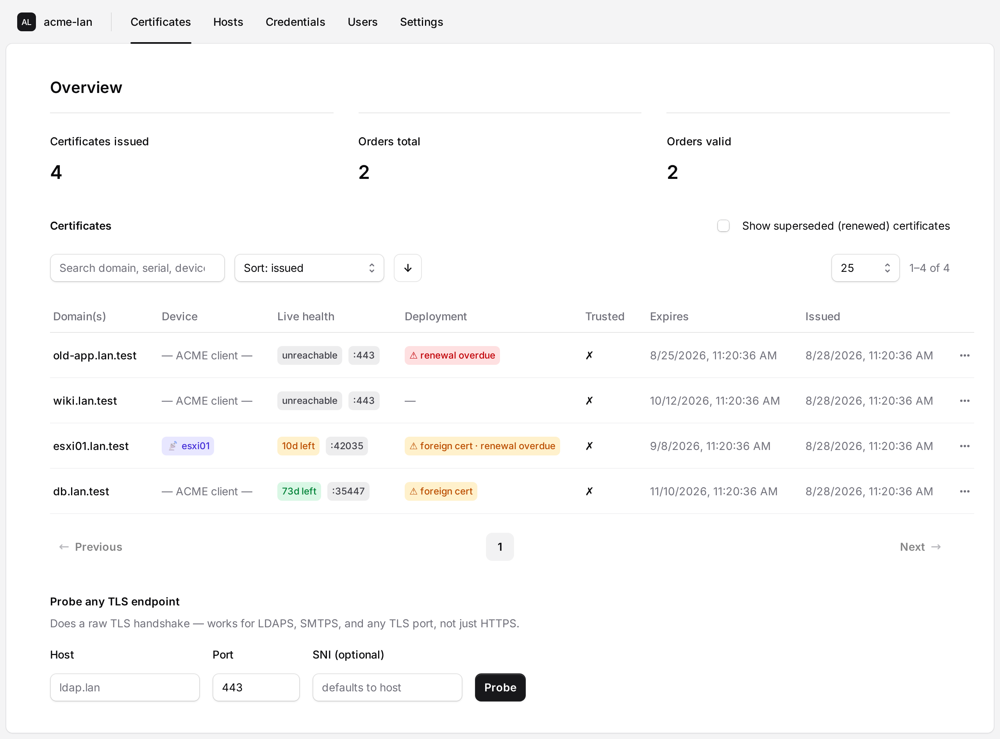

# Deployment

How to deploy **acme-lan** for a LAN. If you just want to understand the project, start
with the [README](../README.md); for the key-handling model see
[SECURITY.md](SECURITY.md); for day-2 operations see [MAINTENANCE.md](MAINTENANCE.md).

- [1. What you need first](#1-what-you-need-first)
- [2. Quick start (Docker)](#2-quick-start-docker)
- [3. Docker Compose (recommended)](#3-docker-compose-recommended)
- [4. Configuration reference](#4-configuration-reference)
- [5. Choosing how control is proven upstream](#5-choosing-how-control-is-proven-upstream)
- [6. Serving acme-lan over trusted HTTPS](#6-serving-acme-lan-over-trusted-https)
- [7. Pointing clients at acme-lan](#7-pointing-clients-at-acme-lan)
- [8. Managed hosts (device push)](#8-managed-hosts-device-push)
- [9. Extra ACME listeners (DigiCert / private CA)](#9-extra-acme-listeners-digicert--private-ca)
- [10. Expiry notifications](#10-expiry-notifications)
- [11. Networking & firewall summary](#11-networking--firewall-summary)
- [12. Verifying the deployment](#12-verifying-the-deployment)

---

## 1. What you need first

- **Split-horizon DNS for a public zone.** e.g. `example.net` is a real public zone, and on
  the LAN `db.example.net` resolves to an RFC-1918 address. acme-lan issues *publicly
  trusted* certs for these internal names.
- **A DNS provider acme-lan can update** (for the default DNS-01 path): a Cloudflare API
  token, or an [acme-dns](https://github.com/joohoi/acme-dns) instance. Only acme-lan holds
  these credentials.
- **A host to run the container** on the LAN, reachable by your internal clients on a port
  (default `8000`).
- **A Fernet secret key** (`ACME_LAN_SECRET_KEY`) — required for storing device credentials,
  device-generated keys, the upstream account key, and the self-service TLS key encrypted.
  Generate one:

  ```bash
  docker run --rm ghcr.io/smallsam/acme-lan \
    python -c "from cryptography.fernet import Fernet; print(Fernet.generate_key().decode())"
  # or locally:
  python -c "from cryptography.fernet import Fernet; print(Fernet.generate_key().decode())"
  ```

> Start against **Let's Encrypt staging** (the default) until everything works, then switch
> `ACME_LAN_UPSTREAM_DIRECTORY_URL` to production to avoid rate limits.

## 2. Quick start (Docker)

The image's entrypoint **auto-migrates the database** and then serves. Persist `/app/data`
on a volume so the database and encrypted keys survive restarts/upgrades.

```bash
docker run -d --name acme-lan \
  -p 8000:8000 \
  -v acme-lan-data:/app/data \
  -e ACME_LAN_EXTERNAL_URL="http://acme-lan.example.net:8000" \
  -e ACME_LAN_SECRET_KEY="<paste-your-fernet-key>" \
  -e ACME_LAN_UPSTREAM_ACCOUNT_EMAIL="you@example.net" \
  -e ACME_LAN_UPSTREAM_DIRECTORY_URL="https://acme-staging-v02.api.letsencrypt.org/directory" \
  -e ACME_LAN_DNS_PROVIDER="cloudflare" \
  -e ACME_LAN_CLOUDFLARE_API_TOKEN="<cloudflare-token>" \
  -e ACME_LAN_ADMIN_TOKEN="<random-admin-token>" \
  ghcr.io/smallsam/acme-lan:latest
```

Open the dashboard at `http://acme-lan.example.net:8000/` and the ACME directory at
`/acme/directory`.

## 3. Docker Compose (recommended)

```yaml
# docker-compose.yml
services:
  acme-lan:
    image: ghcr.io/smallsam/acme-lan:latest   # or <your-dockerhub-user>/acme-lan
    restart: unless-stopped
    ports:
      - "8000:8000"        # dashboard + ACME endpoints
      # - "80:80"          # only if using the edge HTTP-01 upstream path (section 5)
    volumes:
      - acme-lan-data:/app/data
    environment:
      ACME_LAN_EXTERNAL_URL: "https://acme-lan.example.net"
      ACME_LAN_SECRET_KEY: "${ACME_LAN_SECRET_KEY}"          # from your .env / secrets
      ACME_LAN_ADMIN_TOKEN: "${ACME_LAN_ADMIN_TOKEN}"
      ACME_LAN_UPSTREAM_DIRECTORY_URL: "https://acme-v02.api.letsencrypt.org/directory"
      ACME_LAN_UPSTREAM_ACCOUNT_EMAIL: "you@example.net"
      ACME_LAN_DNS_PROVIDER: "cloudflare"
      ACME_LAN_CLOUDFLARE_API_TOKEN: "${CLOUDFLARE_API_TOKEN}"
      # Serve acme-lan itself over trusted HTTPS (section 6); the certificate domain
      # defaults to the hostname of ACME_LAN_EXTERNAL_URL:
      ACME_LAN_SELF_CERT_ENABLED: "true"
      # Renew managed-host certs automatically (section 8):
      ACME_LAN_AUTO_RENEW_ENABLED: "true"

volumes:
  acme-lan-data:
```

Keep secrets in a `.env` file next to the compose file (never commit it):

```dotenv
ACME_LAN_SECRET_KEY=...
ACME_LAN_ADMIN_TOKEN=...
CLOUDFLARE_API_TOKEN=...
```

```bash
docker compose up -d
docker compose logs -f          # watch startup + migrations
```

## 4. Configuration reference

Every setting can be changed in **two** places, and it matters which:

| Layer | Where | Wins? |
| --- | --- | --- |
| Environment (`ACME_LAN_*`, or an `.env` file) | `docker run -e …`, Compose `environment:` | **Yes** — highest priority |
| Dashboard → **Settings** | YAML file at `ACME_LAN_CONFIG_FILE` (default `/app/data/config.yml`) | Only where no env var is set |
| Built-in defaults | the code | Fallback |

**Every** option appears on the Settings screen, grouped by area, with a badge showing where
its value comes from. An option supplied by the environment is shown **read-only** and
labelled *set by environment*: the dashboard writes a file, and a file cannot override a
process's environment, so it tells you to change it where the environment is defined rather
than silently accepting an edit that would have no effect. Attempting it through the API
returns `409`.

Secrets (tokens, passwords, the Fernet key, the OIDC client secret) are **never** sent to
the browser — the screen shows only whether one is set, and typing a new value replaces it.
The YAML file is written `0600` because it can hold those values.

Anything editable that you've saved can be reverted to its default with **reset**, which
removes the key from the file. [`.env.example`](../.env.example) remains the annotated
reference for the environment names; the most important ones:

### Core

| Variable | Default | Purpose |
| --- | --- | --- |
| `ACME_LAN_EXTERNAL_URL` | `http://localhost:8000` | Base URL clients use; **must** match how they reach acme-lan (used to build ACME URLs). |
| `ACME_LAN_DATABASE_URL` | `sqlite+aiosqlite:///./data/acme_lan.db` (container: `/app/data/…`) | Async SQLAlchemy URL. |
| `ACME_LAN_SECRET_KEY` | *(empty)* | Fernet key encrypting all at-rest secrets. Strongly recommended; required for self-TLS. |
| `ACME_LAN_ADMIN_TOKEN` | *(empty)* | If set, the management API + dashboard require `Authorization: Bearer <token>`. ACME endpoints are never gated. |

### Upstream CA

| Variable | Default | Purpose |
| --- | --- | --- |
| `ACME_LAN_UPSTREAM_DIRECTORY_URL` | LE **staging** | The real CA acme-lan proxies to. Switch to production when ready. |
| `ACME_LAN_UPSTREAM_ACCOUNT_EMAIL` | *(empty)* | Contact email for the upstream account. |
| `ACME_LAN_UPSTREAM_CHALLENGE` | `dns-01` | `dns-01` or `http-01` (edge). See section 5. |
| `ACME_LAN_UPSTREAM_FINALIZE_TIMEOUT` | `90` | Seconds to wait for upstream issuance. |

### DNS provider (for DNS-01)

| Variable | Default | Purpose |
| --- | --- | --- |
| `ACME_LAN_DNS_PROVIDER` | `cloudflare` | `cloudflare` \| `acmedns`. |
| `ACME_LAN_CLOUDFLARE_API_TOKEN` | *(empty)* | Token scoped to `Zone.DNS:Edit` for your zone(s). |
| `ACME_LAN_ACMEDNS_API_URL` / `_USERNAME` / `_PASSWORD` / `_SUBDOMAIN` | *(empty)* | acme-dns delegation. |
| `ACME_LAN_DNS_PROPAGATION_SECONDS` | `20` | Delay after publishing TXT before answering the challenge. |

### Storage backends, self-TLS, renewal, notifications

See [section 6](#6-serving-acme-lan-over-trusted-https), [section 8](#8-managed-hosts-device-push),
[section 10](#10-expiry-notifications), and the storage/renewal blocks in
[`.env.example`](../.env.example) (`ACME_LAN_CERT_STORE_BACKEND`, `ACME_LAN_AZURE_KEYVAULT_URL`,
`ACME_LAN_VAULT_*`, `ACME_LAN_AUTO_RENEW_ENABLED`, `ACME_LAN_RENEW_BEFORE_DAYS`,
`ACME_LAN_EXPIRY_WARN_DAYS`, `ACME_LAN_POSTMARK_*`, `ACME_LAN_NOTIFY_*`).

### Signing in (local accounts and single sign-on)

Out of the box the dashboard is **open** — the trusted-LAN / reverse-proxy-auth posture it
has always had. To require a login, add an account under **Users**, then turn on
**Require login** (Settings → Authentication). Enabling it before any account exists is safe:
the login screen then offers to create the first administrator, so you cannot lock yourself
out. The ACME protocol endpoints are never gated — clients authenticate with their own
account keys per RFC 8555 — and `ACME_LAN_ADMIN_TOKEN` keeps working for scripts.

Sessions are rows in the database behind an HTTP-only cookie, so disabling a user or changing
their password signs them out immediately. Passwords are stored as PBKDF2-HMAC-SHA256.

**Microsoft Entra ID** takes three steps (Settings → Authentication walks through them):

1. Register an application in Entra and add the redirect URI the screen shows you —
   `<your external URL>/api/auth/oidc/callback`.
2. Set *OIDC provider* to `entra` and paste the **directory (tenant) ID**, the client ID and
   a client secret. Everything else (authority, discovery, endpoints) is derived from the
   tenant ID.
3. Tick *Enable OIDC login*, save, and press **Test connection** to confirm discovery
   resolves before you rely on it.

Any other OpenID Connect provider works with provider `generic` and a discovery
(`.well-known/openid-configuration`) URL. The flow is authorization-code with PKCE. By
default a local user record is created on first successful sign-in; restrict who may sign in
with *Allowed email addresses*, or turn off *Create users on first OIDC login* to accept only
people you've already added.

## 5. Choosing how control is proven upstream

When a client asks acme-lan for a cert, acme-lan must prove control of the name to the
upstream CA. Two modes (`ACME_LAN_UPSTREAM_CHALLENGE`):

### `dns-01` (default) — works for internal-only hosts

acme-lan publishes `_acme-challenge.<name>` TXT via your DNS provider. Nothing needs to be
publicly reachable. Requirements:

- **Cloudflare:** create an API token with `Zone.DNS:Edit` on the relevant zone(s) and set
  `ACME_LAN_CLOUDFLARE_API_TOKEN`.
- **acme-dns:** register an account with your acme-dns server, add the one-time
  `CNAME _acme-challenge.<name> -> <subdomain>.<acme-dns-domain>`, and set the
  `ACME_LAN_ACMEDNS_*` variables. Only acme-dns credentials live on acme-lan.

### `http-01` (edge) — faster, needs public reachability

acme-lan answers the upstream's HTTP-01 from an edge responder on
`ACME_LAN_EDGE_HTTP_PORT` (default `80`). Point a **wildcard A record** (`*.example.net`) at
the edge public IP so the upstream reaches acme-lan. Publish port 80 to the container and
set `ACME_LAN_UPSTREAM_CHALLENGE=http-01`.

## 6. Serving acme-lan over trusted HTTPS

The whole point is to eliminate TLS warnings — including on acme-lan's own dashboard. Two
options:

### A. Let acme-lan certify itself (built-in)

```env
ACME_LAN_SELF_CERT_ENABLED=true
ACME_LAN_SECRET_KEY=<required>
# Optional: defaults to the hostname of ACME_LAN_EXTERNAL_URL
#ACME_LAN_SERVICE_DOMAIN=acme-lan.example.net
```

On startup acme-lan obtains a cert for `service_domain` via the default upstream, serves
HTTPS with it on `ACME_LAN_TLS_PORT` (default `8443`, expose it alongside the HTTP port),
and renews it in the background. Plain HTTP keeps working on the main port; its dashboard
shows a banner linking to the HTTPS URL. Set `ACME_LAN_EXTERNAL_URL` to the `https://` URL
(e.g. `https://acme-lan.example.net:8443`) so directory URLs point clients at TLS. The
private key is stored **encrypted** and only materialized into memory (never a plaintext
file) — see [SECURITY.md](SECURITY.md).

> Requires `ACME_LAN_SECRET_KEY`; without it acme-lan refuses (rather than writing a
> plaintext key) and stays on HTTP.

### B. Terminate TLS at a reverse proxy

Run acme-lan on HTTP behind nginx/Caddy/Traefik that holds the cert. Set
`ACME_LAN_EXTERNAL_URL` to the public `https://` URL, forward to `:8000`, and (optionally)
have the proxy enforce auth instead of `ACME_LAN_ADMIN_TOKEN`.

## 7. Pointing clients at acme-lan

Standard ACME clients, unchanged except for the directory URL:

```bash
# acme.sh
acme.sh --issue -d db.example.net \
  --server https://acme-lan.example.net/acme/directory ...

# certbot
certbot certonly \
  --server https://acme-lan.example.net/acme/directory \
  -d db.example.net ...
```

The client proves control to acme-lan over the LAN (HTTP-01 by default). acme-lan validates
by fetching `http://<name>/.well-known/acme-challenge/<token>` — so the name must resolve
(LAN view) to the client and reach it on port 80. It then does the real upstream issuance.

## 8. Managed hosts (device push)

For devices that can't run ACME (ESXi, iDRAC, printers, switches), acme-lan issues and
installs the cert. Configure via the dashboard or the API (`/api/hosts`, `/api/credentials`).

- **CSR source (`csr_source`):**
  - `device` *(preferred)* — acme-lan fetches a CSR from the device and pushes back only the
    signed cert; the private key never touches acme-lan.
  - `local` — acme-lan generates the key + CSR and pushes both (the key is stored encrypted;
    the UI warns).
- **Deploy plugins** (`GET /api/deploy-plugins`): `local` (write files + reload command) and
  `ssh` (SFTP upload + reload). Config is plugin-specific (e.g. `remote_cert_path`,
  `remote_key_path`, `reload_command`, `remote_csr_path`/`csr_command`). Writing your own
  (e.g. a vendor CLI over SSH) is covered in **[docs/PLUGINS.md](PLUGINS.md)**.
- **Credentials** (`/api/credentials`): `provider=local` stores a Fernet-encrypted secret;
  `provider=azure_keyvault`/`vault` store only a reference and fetch the secret at deploy
  time. Requires `ACME_LAN_SECRET_KEY` (local) or the relevant provider settings.
- **Auto-renew:** set `ACME_LAN_AUTO_RENEW_ENABLED=true`; hosts whose latest cert expires
  within `ACME_LAN_RENEW_BEFORE_DAYS` are renewed and redeployed. Trigger manually with
  `POST /api/hosts/{id}/renew`.

## 9. Extra ACME listeners (DigiCert / private CA)

A single acme-lan can host several listeners under `/acme/p/<name>/`, each with its own
upstream. Manage via `/api/acme-profiles`:

- **`upstream_type=acme`** — proxy to another ACME CA, including EAB-authenticated ones like
  DigiCert (`eab_kid` + `eab_hmac_key`).
- **`upstream_type=ca_handler`** — issue from a **private CA** that doesn't speak ACME
  (acme2certifier-style). Ships `local_ca` (signs CSRs with a CA cert+key you provide) — ideal
  for WiFi/EAP certs. List handlers with `GET /api/ca-handlers`.

Clients target the profile directory, e.g. `https://acme-lan.example.net/acme/p/wifi/directory`.

## 10. Expiry notifications

acme-lan warns about certs expiring within `ACME_LAN_EXPIRY_WARN_DAYS` (default 21) over any
configured channel; the notifier runs automatically when at least one is set:

- **Email (Postmark):** `ACME_LAN_POSTMARK_SERVER_TOKEN`, `ACME_LAN_NOTIFY_EMAIL_FROM`,
  `ACME_LAN_NOTIFY_EMAIL_TO` (comma-separated).
- **Webhook:** `ACME_LAN_NOTIFY_WEBHOOK_URL` (receives a JSON POST).

Test with `POST /api/notifications/test`. Mark a cert "no longer required" with
`POST /api/certificates/{id}/retire` to stop warnings for it.

## 11. Networking & firewall summary

| From → To | Port | When |
| --- | --- | --- |
| Internal clients → acme-lan | `8000` (or 443 via self-TLS/proxy) | Always |
| acme-lan → upstream CA (HTTPS) | `443` | Always |
| acme-lan → DNS provider API (HTTPS) | `443` | DNS-01 |
| acme-lan → client `http://<name>/.well-known/...` | `80` | Downstream HTTP-01 validation |
| Upstream CA → acme-lan edge | `ACME_LAN_EDGE_HTTP_PORT` (80) | Only for `http-01` upstream |
| acme-lan → device (SSH/SFTP or plugin transport) | e.g. `22` | Device push |

## 12. Verifying the deployment

```bash
# Liveness
curl -fsS https://acme-lan.example.net/healthz            # {"status":"ok"}

# ACME directory
curl -fsS https://acme-lan.example.net/acme/directory

# Management API (if ACME_LAN_ADMIN_TOKEN is set, add: -H "Authorization: Bearer <token>")
curl -fsS https://acme-lan.example.net/api/stats
curl -fsS https://acme-lan.example.net/api/certificates

# Issue a real cert end-to-end with a normal client (see section 7), then confirm it in
# the dashboard's live health view.
```

Once verified against staging, switch `ACME_LAN_UPSTREAM_DIRECTORY_URL` to production and
restart.

The dashboard (at `ACME_LAN_EXTERNAL_URL`) then shows every certificate with a live health
badge, the managed-host list, and an ad-hoc TLS probe:


